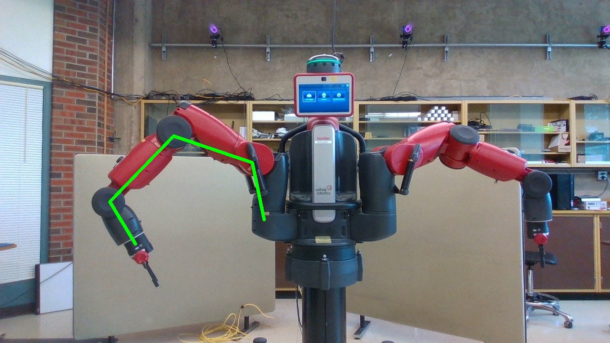

# Monocular camera based joint angle estimation of Baxter robot for sensroless actuation 

This proof of concept model demonstrates sensorless actuation of Rethink robotics baxter robot, using a combination of deeep learning and optimization based joint angle estimation

This two step method involves  
- Keypoint detection using keypoint rcnn model  
- Levenberg-Marquardt optimization of joint angles using obtained pixels  

# Keypoint rcnn on static image

# Real time joint angle estimation

