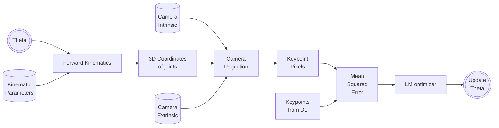

# C++ implementation of joint angle solver from keypoints

* Inverse kinematics is a non-linear problem without a simple closed form solution.
* Hence we go for a numerical solution based on Levenberg-Marquardt optimizer.
* This solver requires a mapper function which maps input variable to the observed variable.
* In our case the variable to be solved for is theta and the observed paramter which maps from theta is keypoint pixel.
* Hence we define a mapper function which maps theta to keypoint pixels projected onto the camera, roughly following the schematic given below.




* LM is implemented in C++ using the Eigen library
* A sample LM implementation with **jacobian** is given below
    * inputs() returns number of variables
    * values() returns number of constraints
```
#include <iostream>
#include <Eigen/Dense>
#include <unsupported/Eigen/NonLinearOptimization>

struct MyFunctor
{
  int operator()(const Eigen::VectorXf &x, Eigen::VectorXf &fvec) const
  {
    // Cost function or the error function
    return 0;
  }
  int df(const Eigen::VectorXf &x, Eigen::MatrixXf &fjac) const
  {
    // Jacobian of cost function with respect to the  input variables
    return 0;
  }
  int inputs() const { return m; }
  int values() const { return n; } // number of constraints
};


int main(int argc, char *argv[])
{
  Eigen::VectorXf x(1);
  x << 1;
  std::cout << "x: " << x << std::endl;

  MyFunctor functor;
  Eigen::LevenbergMarquardt<MyFunctor, float> lm(functor);
  lm.minimize(x);

  std::cout << "x that minimizes the function: " << x << std::endl;

  return 0;
}

```

* A sample LM implementation with **numerical differentiation** is given below
  * inputs() returns number of variables
  * values() returns number of constraints
```
#include <iostream>
#include <fstream>
#include <Eigen/Dense>
#include <unsupported/Eigen/NonLinearOptimization>
#include <unsupported/Eigen/NumericalDiff>
//____________________________________________________________________________________________
using namespace std;
using namespace Eigen;
//____________________________________________________________________________________________
// Generic functor
template<typename _Scalar, int NX = Eigen::Dynamic, int NY = Eigen::Dynamic>
struct Functor1
{
typedef _Scalar Scalar;
enum {
    InputsAtCompileTime = NX,
    ValuesAtCompileTime = NY
};
typedef Eigen::Matrix<Scalar,InputsAtCompileTime,1> InputType;
typedef Eigen::Matrix<Scalar,ValuesAtCompileTime,1> ValueType;
typedef Eigen::Matrix<Scalar,ValuesAtCompileTime,InputsAtCompileTime> JacobianType;

int m_inputs, m_values;

Functor1() : m_inputs(InputsAtCompileTime), m_values(ValuesAtCompileTime) {}
Functor1(int inputs, int values) : m_inputs(inputs), m_values(values) {}

int inputs() const { return m_inputs; }
int values() const { return m_values; }

};

struct my_functor1 : Functor1<double>
{
my_functor1(void): Functor1<double>(4,4) {}
int operator()(const Eigen::VectorXd &x, Eigen::VectorXd &fvec) const
{
    // Cost function or the error function
    return 0;
}
};

//____________________________________________________________________________________________

int main(int argc, char *argv[])
{

    Eigen::VectorXd x(4);
    x.setConstant(0);

    my_functor1 functor1;
    Eigen::NumericalDiff<my_functor1> numDiff(functor1);
    Eigen::LevenbergMarquardt<Eigen::NumericalDiff<my_functor1>,double> lm(numDiff);
    lm.parameters.maxfev = 500;
    lm.parameters.xtol = 1.0e-10;
    lm.parameters.factor = 1;
    lm.minimize(x);

    std::cout << "x that minimizes the function: " << x << std::endl;

    return 0;
}

```

* [lm_joint_angle_solver.cpp](https://gitlab.com/barczyk-mechatronic-systems-lab/keypoint_detection/-/blob/main/joint_detection/lm_joint_angle_solver.cpp) contains c++ implementation of joint angle solver for Baxter robot, assuming that the camera intrinsics and extrinsics are known. You can change [observed keypoints](https://gitlab.com/barczyk-mechatronic-systems-lab/keypoint_detection/-/blob/main/joint_detection/lm_joint_angle_solver.cpp#L226-L228)/[intrinsics](https://gitlab.com/barczyk-mechatronic-systems-lab/keypoint_detection/-/blob/main/joint_detection/lm_joint_angle_solver.cpp#L207-L209)/[extrinsics](https://gitlab.com/barczyk-mechatronic-systems-lab/keypoint_detection/-/blob/main/joint_detection/lm_joint_angle_solver.cpp#L213-L219) to update dynamically depending on use case.

* [joint_angle_solver_ros.cpp](https://gitlab.com/barczyk-mechatronic-systems-lab/keypoint_detection/-/blob/main/joint_detection/joint_angle_solver_ros.cpp) contains ros based c++ implementation for real time solution of joint angles from keypoints. 
